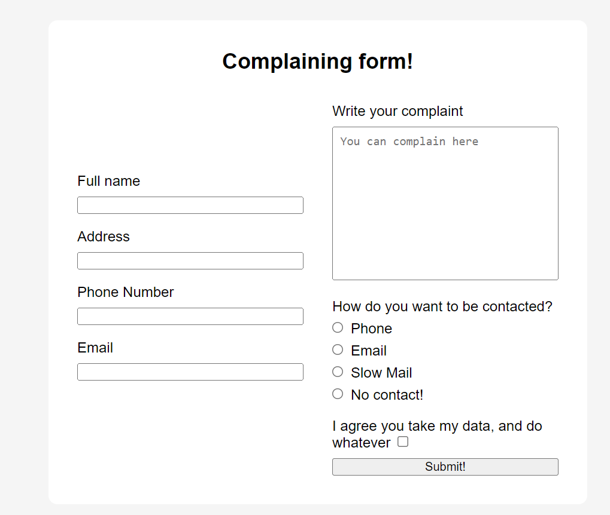

# React Forms Practice

## Learning Objectives
- Use event listeners for forms, including submit and change events
- Explain the difference between controlled and uncontrolled elements, including form elements.
- Build a component with a controlled form that has multiple inputs of different types
- Refactor a component that uses multiple state hooks to use one that dynamically handles multiple inputs

## Instructions
- Make the form in App.js a controlled form
  - Add state for each field
  - Make each field a controlled component
  - `console.log` the value of each field when the form is submitted

## Extension 1
- Refactor your solution to use a single form state object